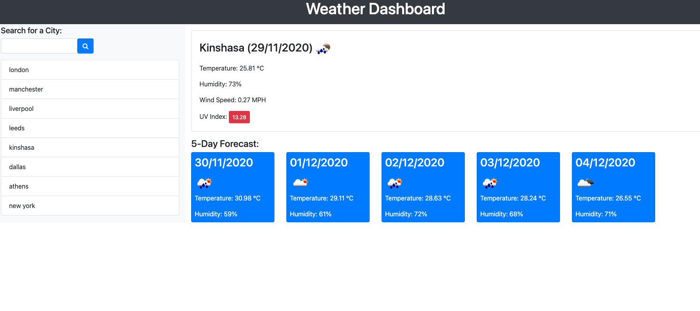

# Weather-Dashboard

In this project, I have developed an application that uses HTML and jQuery that helps the user to retrieve weather information for different locations. The application runs in the browser and gets its updated weather informations from a third party API called OpenWeather.

The link to the webpage

